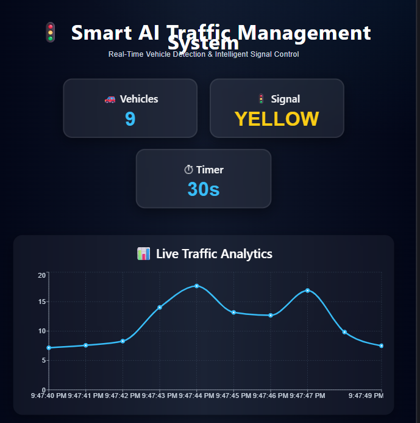
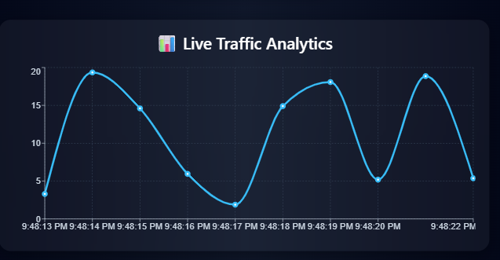

# 🚦 Smart AI Traffic Management System

An AI-powered traffic monitoring and intelligent signal control system built using React.js, Flask, Python, and modern data visualization tools.

---

# 🌟 Features

✅ Real-Time Vehicle Count Simulation  
✅ Smart Traffic Signal Logic  
✅ Dynamic Timer System  
✅ Live Traffic Analytics Dashboard  
✅ Animated Modern UI  
✅ Responsive Design  
✅ Cloud Deployment using Netlify & Render  

---

# 🛠 Tech Stack

## Frontend
- React.js
- Axios
- Framer Motion
- Recharts

## Backend
- Flask
- Python
- Flask-CORS

## Deployment
- GitHub
- Netlify
- Render

---

# 📊 Smart Signal Logic

| Vehicle Count | Signal | Timer |
|---|---|---|
| 0 – 5 | 🔴 RED | 15s |
| 6 – 10 | 🟡 YELLOW | 30s |
| 10+ | 🟢 GREEN | 45s |

---

# 🌐 Live Demo

## Frontend
https://ai-traffic-system.netlify.app

## Backend API
https://smart-ai-traffic-system.onrender.com

---

# 📷 Project Screenshots

## Dashboard UI


## Live Analytics



---

# ⚙️ Installation Guide

## Clone Repository

```bash
git clone https://github.com/dhanujvardhan/smart-ai-traffic-system.git
```

---

## Backend Setup

```bash
cd backend
pip install -r requirements.txt
python app.py
```

---

## Frontend Setup

```bash
cd frontend
npm install
npm run dev
```

---

# 🚀 Future Improvements

- Real CCTV Integration
- AI-Based Traffic Prediction
- Emergency Vehicle Detection
- Firebase Database
- Authentication System
- Dark/Light Theme
- Live Camera Feed

---

# 👨‍💻 Author

## Dhanuj Vardhan Goyal

B.Tech CSE (AI & ML)  
